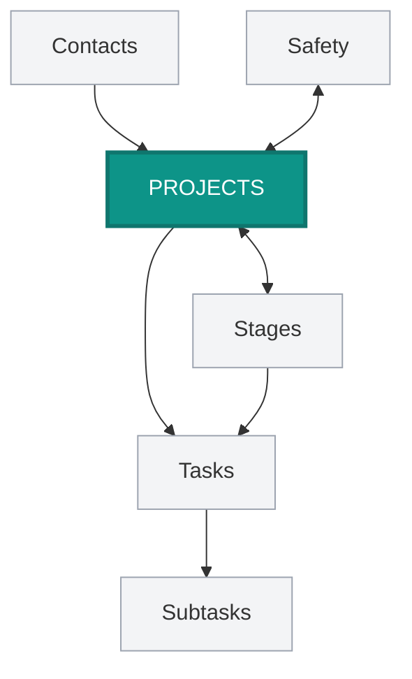

# How Everything Connects

This doc explains the **relationships** between PSS Podio apps—how they link together and why it matters.

---

## The Hub-and-Spoke Model

Think of your Podio workspace like a wheel:

- **Projects** = The hub (center)
- **Everything else** = Spokes connecting to the hub

Every item eventually traces back to a project. This keeps information organized and findable.



---

## The Relationship Hierarchy

Here's how things nest:

| Level | App | Belongs To |
|-------|-----|------------|
| 1 | **Projects** | — (top level) |
| 2 | **Stages** | Project |
| 3 | **Tasks** | Stage AND Project |
| 4 | **Subtasks** | Task (which belongs to Stage/Project) |

A task knows its stage, its project, and (if it's a subtask) its parent task.

---

## How Links Are Created

### Automatic Links (You Don't Create These)

| When This Happens | These Links Are Made |
|-------------------|---------------------|
| New project created | 5 Stages → linked to project |
| New project created | Safety record → linked to project |
| Stage becomes "Active" | Tasks created → linked to stage AND project |
| Task has subtasks | Subtasks → linked to parent task |

### Manual Links (You Create These)

| Link Type | When You Do It |
|-----------|---------------|
| Customer / GC → Contacts | When creating/editing a project |
| Related Tasks on Safety | When connecting safety items to specific tasks |
| Linked Projects on Contacts | When adding a contact to a project |

---

## Following the Links

Links are **bidirectional**. If Project A links to Stage B, then Stage B links back to Project A.

This means you can navigate in either direction:

**From Project:**
- Click Linked Stages → see all 5 stages
- Click Linked Safety & Compliance → see safety records
- Click Customer / GC → jump to contact

**From Task:**
- Click Linked Stage → jump to that stage
- Click Linked Project → jump to the project
- Click Dependencies → see prerequisite tasks


---

## Why This Matters

### 1. Everything Is Findable
Start at any point and navigate to related items. Looking at a task? One click to see the whole project.

### 2. Data Stays Connected
When you update a project's PM, every linked stage and task still knows who the PM is (through the relationship).

### 3. Filters Become Powerful
You can filter tasks by **their project's** fields:
- "Show tasks where project's Division = Concrete"
- "Show tasks where project's PM = Sarah"

### 4. Automations Know Where to Put Things
When the system creates tasks, it uses relationships to put them in the right place automatically.

---

## The Task Dependency Chain

Tasks have a special relationship: **Dependencies**.

This isn't a parent-child link. It's a "this waits for that" link.

```
Task A (Independent)
    │
    └──► Task B (Depends on A)
              │
              └──► Task C (Depends on B)
```

- Task B can't start until Task A is complete
- Task C can't start until Task B is complete

When you complete Task A, Task B automatically moves to "In Progress" and the responsible person gets notified.


---

## Relationship Fields Reference

### Projects App

| Relationship Field | Connects To | Type |
|-------------------|-------------|------|
| Customer / GC | Contacts | Single (one contact) |
| Linked Stages | Stages | Multi (5 stages) |
| Linked Safety & Compliance | Safety | Multi |

### Stages App

| Relationship Field | Connects To | Type |
|-------------------|-------------|------|
| Linked Project | Projects | Single (one project) |
| Task Overview | Tasks | Multi (many tasks) |

### Tasks App

| Relationship Field | Connects To | Type |
|-------------------|-------------|------|
| Linked Project | Projects | Single |
| Linked Stage | Stages | Single |
| Linked Parent Task | Tasks | Single (for subtasks) |
| Dependencies | Tasks | Multi (prerequisite tasks) |

### Safety & Compliance App

| Relationship Field | Connects To | Type |
|-------------------|-------------|------|
| Linked Project | Projects | Single |
| Related Tasks | Tasks | Multi |

### Contacts App

| Relationship Field | Connects To | Type |
|-------------------|-------------|------|
| Linked Projects | Projects | Multi |

---

## Template Relationships (Behind the Scenes)

The template apps also have relationships that the automation system uses:

| App | Relationship Field | Connects To |
|-----|-------------------|-------------|
| Task Templates | Linked Subtasks | Subtask Templates |
| Subtask Templates | Linked Main Task | Task Templates |

You won't interact with these directly. GlobiFlow uses them to know which subtasks to create for each main task.

---

## Common Navigation Patterns

### "I have a task, where does it belong?"
1. Open the task
2. Check Linked Stage → tells you the stage
3. Check Linked Project → tells you the project

### "I want to see all tasks for a project"
1. Open the project
2. Click any Linked Stage
3. Look at Task Overview

Or use a view in the Tasks app filtered by Linked Project.

### "I need to update contact info for a project"
1. Open the project
2. Click Customer / GC
3. You're now in the Contacts app—edit there
4. Changes reflect everywhere that contact is linked

### "What's blocking this task?"
1. Open the task
2. Check Dependencies field
3. Click through to see the prerequisite task(s)
4. Check their Status—are they complete?

---

## Mental Model Summary

| Concept | Analogy |
|---------|---------|
| Projects | A job folder |
| Stages | Tabs in the folder |
| Tasks | Sticky notes on each tab |
| Subtasks | Smaller sticky notes on a sticky note |
| Relationships | Staples holding things together |
| Dependencies | "Wait for this first" notes |

Everything connects. Nothing floats alone. That's how you keep hundreds of tasks organized across dozens of projects.

---

**Related Docs:**
- [Apps and Items](apps-and-items.md) — What apps and items are
- [Our Apps Explained](our-apps-explained.md) — Details on each app
- [Fields and Data](fields-and-data.md) — The data inside items
- [Views and Filters](views-and-filters.md) — Using relationships to filter
