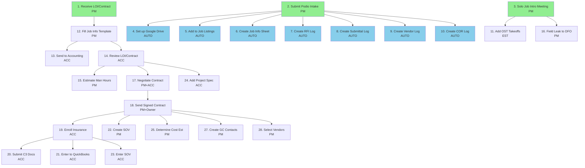
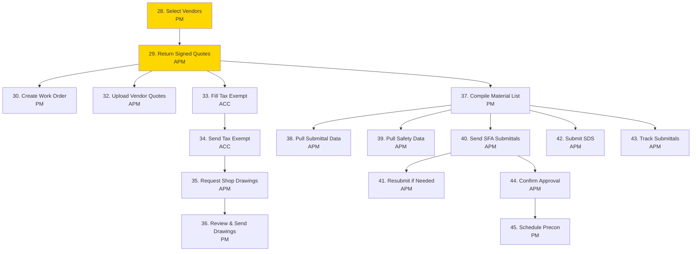
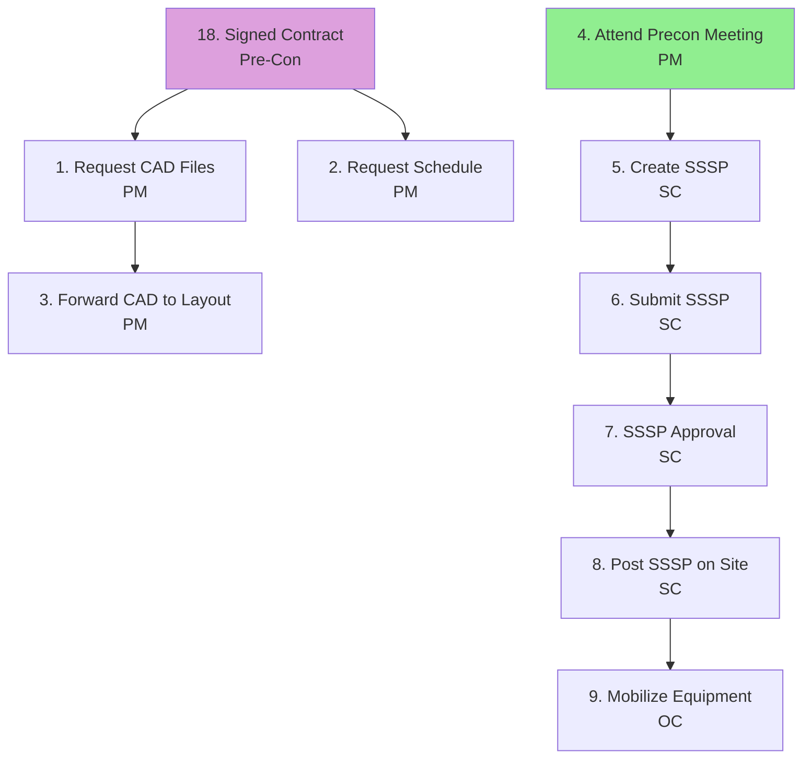
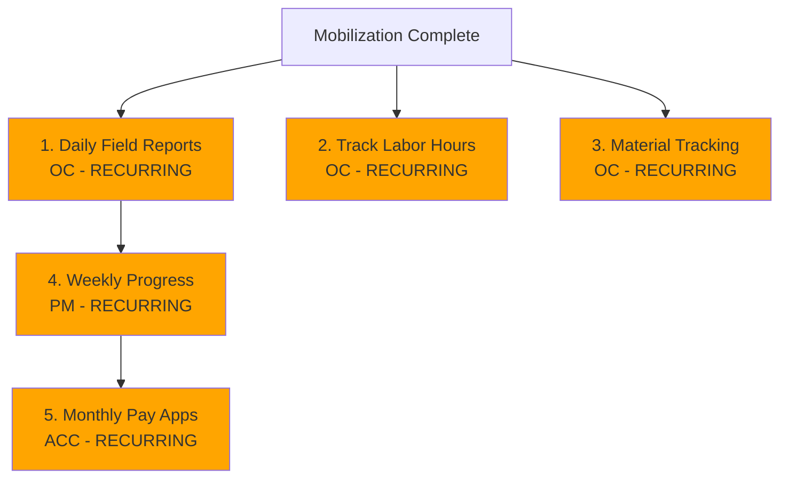

# JLCP Dependency Flowcharts

Visual diagrams showing how tasks flow and depend on each other.

---

## Legend

| Color | Meaning |
|-------|---------|
| 🟢 Green | Independent task (can start immediately) |
| 🟡 Yellow | Dependent task (waiting on predecessor) |
| 🔵 Blue | Automation task (runs automatically) |
| 🟣 Purple | Cross-stage dependency |
| 🟠 Orange | Recurring task |

---

## Pre-Construction Dependencies

This is the most complex stage with 44 tasks and multiple dependency chains.

### Contract & Setup Flow



### Vendor & Submittal Flow



---

## Mobilization Dependencies



---

## Construction Dependencies  



---

## Key Dependency Chains

### 1. Contract Chain (Critical Path)
```
LOI → Job Info → Review → Negotiate → Sign → Insurance → QuickBooks
```
**Owner:** PM → ACC → PM+Owner → ACC

### 2. Submittal Chain
```
Select Vendors → Signed Quotes → Material List → Pull Submittals → Send to GC → Approval → Precon Meeting
```
**Owner:** PM → APM → APM → APM → PM

### 3. Safety Chain
```
Precon Meeting → Create SSSP → Submit SSSP → Approval → Post on Site
```
**Owner:** PM → SC → SC → SC → SC

### 4. 811 Locate Chain (Recurring)
```
Request 811 → Wait for Marks → Document → [Repeat every 2 weeks]
```
**Owner:** SC (recurring)

---

**Related:**
- [jlcp-matrix.md](jlcp-matrix.md) — Full task table
- [dependencies.md](../tasks/dependencies.md) — How dependencies work
